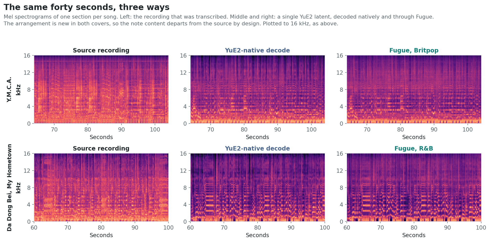
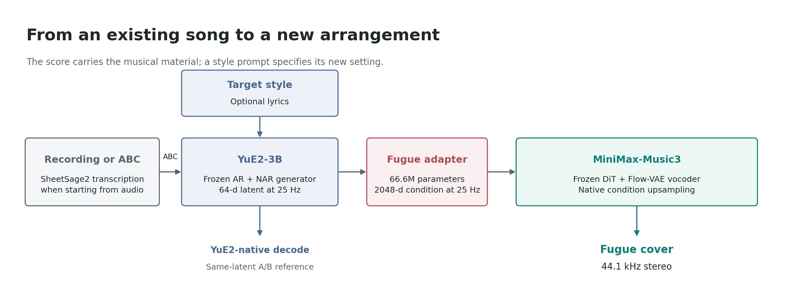
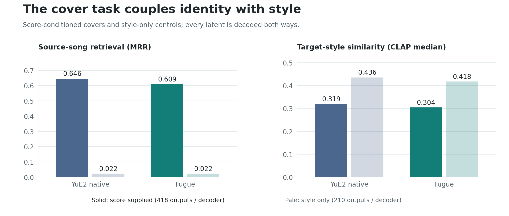
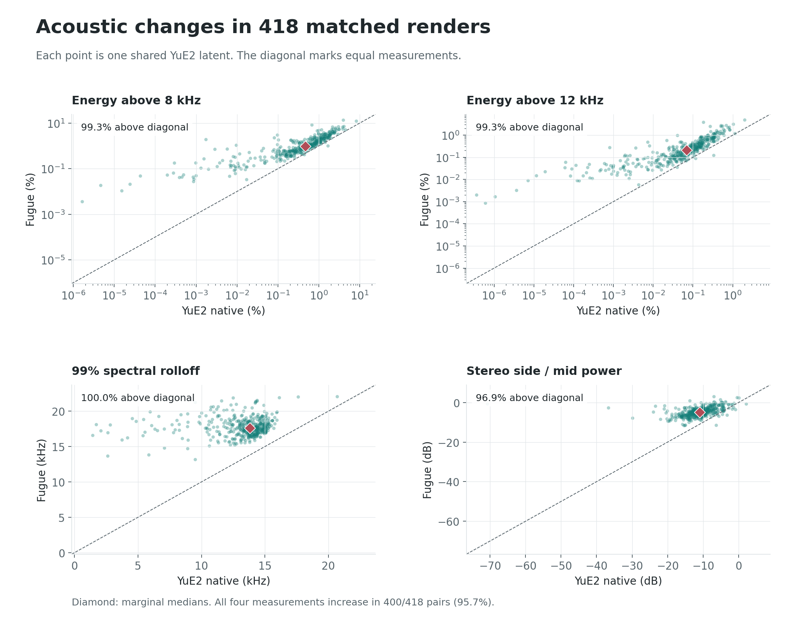
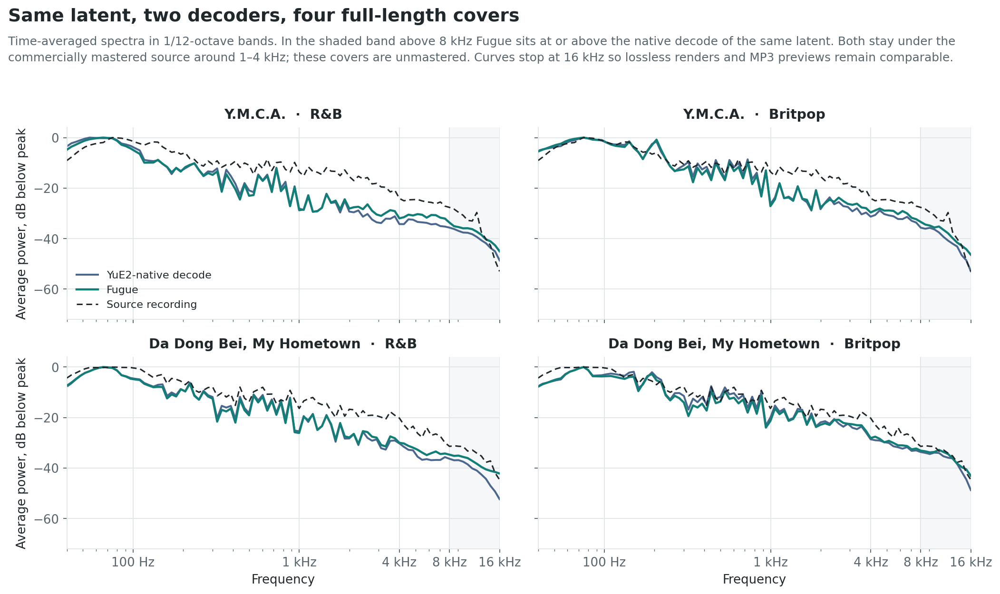
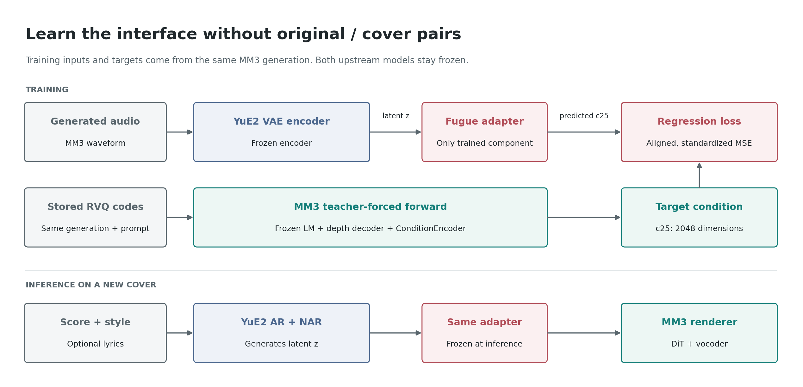

<p align="center">
  
</p>

<h1 align="center">Fugue</h1>

<p align="center"><b>High-fidelity music covers, in the style you choose.</b></p>

Fugue turns a recording or an ABC score into a new arrangement while keeping the song recognizable. It combines YuE2's score-conditioned generation with MiniMax-Music3's acoustic renderer through a learned adapter. Both base models stay frozen.

## Listen first

Four full-length covers of two real recordings, sung in the original words. Each is one uninterrupted generation from the song's SheetSage2 transcription, its lyrics, and a style prompt — no splicing, no truncation, about three minutes of wall clock per track on a single RTX 4090.

| Song | Contemporary R&B | Britpop |
|---|---|---|
| **Y.M.C.A.**, Village People | [4:43 cover](samples/showcase/cover_ymca_rnb_fugue.mp3) | [4:44 cover](samples/showcase/cover_ymca_britpop_fugue.mp3) |
| **大东北我的家乡** / *Da Dong Bei, My Hometown*, He Yu | [4:06 cover](samples/showcase/cover_dadongbei_rnb_fugue.mp3) | [4:03 cover](samples/showcase/cover_dadongbei_britpop_fugue.mp3) |

Both covers of a song share one transcription and one lyric sheet; the style prompt and the YuE2 seed are the only variables. GitHub serves audio files as links rather than players, so these download or open in a new tab. Prompts, seeds, and measurements are in [`samples/README.md`](samples/README.md).



### The same latent, two decoders

Fugue replaces YuE2's own VAE decoder with a learned adapter into MiniMax-Music3. To hear what the renderer contributes, compare **one generated latent** decoded both ways:

| Arrangement | YuE2 native | Fugue |
|---|---|---|
| s-AVE, piano and strings | [Listen](samples/cover_sAVE_piano_yue2_native.mp3) | [Listen](samples/cover_sAVE_piano_fugue.mp3) |
| s-AVE, Britpop | [Listen](samples/cover_sAVE_britpop_yue2_native.mp3) | [Listen](samples/cover_sAVE_britpop_fugue.mp3) |
| To Know You, Britpop with vocals | [Listen](samples/cover_toKnowYou_britpop_vocal_yue2_native.mp3) | [Listen](samples/cover_toKnowYou_britpop_vocal_fugue.mp3) |

These are 30-second excerpts of **s-AVE**, by SawanoHiroyuki[nZk] with Aimer, next to its [original excerpt](samples/source_sAVE_excerpt.mp3). The piano prompt is `intimate solo piano ballad with soft strings, 75 BPM, A minor, cinematic, instrumental`; the guitar prompt is `1990s Britpop guitar rock, 75 BPM, A minor, driving drums, instrumental`. A [full 4:37 piano cover](samples/cover_sAVE_piano_full_fugue.mp3) is included as well. Every file here is an MP3 preview, not lossless evaluation audio. [Sample details and additional pairs](samples/README.md).

### Why "Fugue"?

In a musical fugue, a recognizable subject returns through interweaving voices. The name expresses what we want from a cover: continuity in a vocal or instrumental melody, with room for the other parts to change and respond. The score gives the new arrangement something specific to remain faithful to.

Full-score conditioning keeps the supplied harmonic context, while the melody-only option removes chord annotations. Both generate a new mixed recording.



## Run a cover

The reference deployment fits on **one 24 GB GPU**. On an RTX 4090 with resident services, a 30-second cover takes about 50 seconds end to end. The full 4:37 example took about 3.3 minutes across AR generation, NAR synthesis, and acoustic rendering.

### Install

From the repository root, install the package and the inference wheel supplied with YuE2:

```bash
pip install -e .
pip install /path/to/YuE2-3B/yue2_infer-0.1.5-py3-none-any.whl
```

The reference services use separate `graphtokenizer` and `mm3` environments for YuE2 and the MM3 Diffusers stack. The minimal package also provides a single-process CLI. Download the following model snapshots before running; the inference wrappers use local/offline loading.

| Component | Model repository | Used for |
|---|---|---|
| YuE2-3B and YuE2-Vae | `m-a-p/YuE2-3B`, `m-a-p/YuE2-Vae` | Score-conditioned AR/NAR generation; optional native A/B decode |
| MiniMax-Music3 | `MiniMaxAI/MiniMax-Music3` | `transformer`, `vocoder`, `condition_encoder`, and `scheduler` |
| SheetSage2 and MERT | `m-a-p/SheetSage2`, `m-a-p/MERT-v2-FullSong` | Transcription; skip these when supplying ABC |
| Fugue adapter v4 | `HenryZ838978/fugue-scion-v4` | 66.6M parameters; weights, normalization statistics, and config |

Set paths to your downloaded snapshots:

```bash
export FUGUE_MM3=/models/MiniMax-Music3
export FUGUE_YUE2=/models/YuE2-3B
export FUGUE_YUE2_VAE=/models/YuE2-Vae
export FUGUE_SHEETSAGE2=/models/SheetSage2
export FUGUE_MERT=/models/MERT-v2-FullSong
export FUGUE_ADAPTER=/models/fugue-scion-v4

# Start with a recording. Also write the native YuE2 decode for comparison.
python -m fugue.cover --audio song.flac \
  --style "intimate solo piano ballad with soft strings, cinematic" --native

# Or supply a score and lyrics.
python -m fugue.cover --abc score.abc \
  --style "1990s Britpop guitar rock, driving drums" --lyrics lyrics.txt
```

`--seconds 30` limits the generated excerpt; the default requests a full-length generation, subject to YuE2's context and token limits. Outputs, the input ABC, and timing metadata are written to `fugue_out/`.

### Controls

| Input | Behavior |
|---|---|
| `--audio` or `--abc` | Transcribe a recording, or use an existing ABC score |
| `--style` | English tags describing genre, instrumentation, mood, and optionally tempo/key |
| `--lyrics` | A text file or text with section tags such as `[Verse]` and `[Chorus]`; omitted means instrumental |
| `--cot full` | Use the supplied score, including chord annotations; default |
| `--cot melody` | Remove quoted chord annotations before generation; does not select or lock an individual voice |
| `--seed`, `--dit_seed` | Set YuE2 generation and acoustic-rendering seeds separately |
| `--native` | Save YuE2's own decode of the generated latent alongside Fugue |

The score and prompt should agree on tempo and key. The CLI only inserts a prompt BPM when the ABC has no `Q:` line; it does not transpose the score to match a key mentioned in the prompt.

### Arena and services

`services/fugue_arena.py` provides an upload-and-style interface with original, YuE2-native, and Fugue players. It uses the resident YuE2/transcription and adapter/rendering services, which can share a GPU. The reference setup occupied approximately 9.8 GB and 4.9 GB respectively. Launch commands are in [`research/scripts/`](research/scripts/); service and model paths must match your installation.

## What the results show

We evaluate **209 real songs, two target styles per song, and 418 shared latents**, each decoded by YuE2 and Fugue. The six styles are piano ballad, Britpop, jazz trio, synthwave, acoustic folk, and orchestral score. Source-song retrieval uses a **210-recording gallery**. A style-only control omits the source score.



The style-only control scores higher on CLAP but loses source-song identity. That is why cover generation needs both measurements: following a style prompt is useful only if the result still refers to the intended song.

| Decoder and input | Outputs | Source Hit@1 | Source MRR | CLAP style, median |
|---|---:|---:|---:|---:|
| YuE2 native, source score | 418 | 0.557 | 0.646 | 0.319 |
| **Fugue, source score** | **418** | **0.524** | **0.609** | **0.304** |
| YuE2 native, style only | 210 | 0.000 | 0.022 | 0.436 |
| Fugue, style only | 210 | 0.000 | 0.022 | 0.418 |

Fugue retains 94% of the native decoder's MRR. The paired Hit@1 difference is -3.35 percentage points; 239 pairs retrieve the source at the same rank. These compare renderers on the same generated latents, not independently sampled songs.

### Acoustic rendering

The author preferred Fugue in the development listening comparisons. The measurements below describe the associated spectral and stereo changes; the A/B samples above let listeners judge the audible result.



| Measurement, median over 418 outputs | YuE2 native | Fugue |
|---|---:|---:|
| Energy above 8 kHz | 0.466% | 0.966% |
| Energy above 12 kHz | 0.070% | 0.209% |
| 99% spectral rolloff | 13.8 kHz | 17.6 kHz |
| Stereo side/mid power | -10.9 dB | -4.8 dB |

High-frequency energy increases in 99.3% of pairs for each band, rolloff in 100%, and side/mid power in 96.9%. All four increase together in **400/418 pairs (95.7%)**.

The four full-length covers behave the same way outside the benchmark, on real recordings rather than generated ones:



Above 8 kHz, Fugue sits at or above the native decode in all four. Both stay under the commercially mastered sources around 1–4 kHz; these covers carry no mastering stage, and their RMS is 3–8 dB below the originals. The curves are plotted to 16 kHz so that lossless renders and MP3 previews remain comparable, and the numbers behind them are stored in [`showcase_spectra.json`](paper/figures/showcase_spectra.json).

Re-transcription interval-DTW has a median paired difference of 0.000 across **372 valid pairs**. The separate arm medians are 0.470 for YuE2 native and 0.523 for Fugue, with 372 and 375 valid outputs respectively. Audiobox-Aesthetics PQ moves in the opposite direction to the author's listening preference, with a median paired change of -0.278; the paper reports both observations.

[Full protocol and paper](paper/fugue.md) · [Summary data](research/eval_summary.json) · [Per-output measurements](research/eval_per_item.json)

## How the graft is trained

**No additional original/cover training pairs are needed.** The adapter learns from MM3's own generated audio and stored codes, not from demonstrations of one song being rearranged into another style.



1. Encode MM3-generated audio with the public YuE2 VAE encoder to obtain 64-dimensional latents at 25 Hz.
2. Teacher-force the stored RVQ codes, caption, and lyrics through MM3 to recover its 2048-dimensional pre-upsampling DiT condition.
3. Train the adapter to map one to the other, correcting the stitched audio time axis and normalizing each channel.
4. At inference, use the latents generated by YuE2's score-conditioned AR/NAR path instead of encoded training audio.

The full paired corpus contains 12,837 generations, about 191 hours; the adapter uses 10,340 training songs. The released v4 adapter trained for 67 minutes on one RTX 4090 **after pair extraction**, with both upstream models frozen. Corpus generation and feature extraction are separate costs. Its held-out variance-weighted R² is 0.671.

The practical result is an additional route into a pretrained renderer: new score-conditioned behavior without retraining either base model. The [paper's discussion](paper/fugue.md#5-discussion-control-after-pretraining) places this alongside activation steering, low-rank adaptation, and inference orchestration, while separating those broader directions from the evaluated graft.

### Python interface

```python
from fugue import FugueAdapter, Rootstock
from fugue.scion import Scion

scion = Scion("/models/YuE2-3B", "/models/YuE2-Vae")
latent, info = scion.generate(
    style="smooth jazz trio, Rhodes piano",
    abc=open("score.abc").read(),
)
adapter = FugueAdapter("/models/fugue-scion-v4")
renderer = Rootstock("/models/MiniMax-Music3")
wav = renderer(adapter(latent), steps=30, seed=7)  # (2, samples), 44.1 kHz
```

## Scope

The main benchmark is instrumental, uses 60-second generations and one YuE2 seed, and draws on a Japanese/Chinese pop and soundtrack catalogue. The vocal and full-length examples above sit outside it: lyric intelligibility and long-form consistency are demonstrated, not measured. The model regenerates a mixed recording rather than copying a selected stem; timbre can shift toward MM3's rendering preferences.

## Repository

| Directory | Contents |
|---|---|
| `fugue/` | Minimal inference package |
| `services/` | Resident services, orchestration CLI, and Gradio arena |
| `samples/` | Cover previews and same-latent comparisons; `samples/showcase/` holds the four full-length covers |
| `paper/` | Paper draft and shared SVG/PNG figures, including their regeneration scripts |
| `research/` | Training, probes, evaluation data, launchers, and the historical lab notebook |
| `assets/` | Project logo |

The result figures are generated from the released JSON measurements, and the showcase figures from the MP3s in `samples/showcase/`. See [`paper/figures/`](paper/figures/README.md) to reproduce them. The historical [`SCION.md`](research/SCION.md) preserves the experiments and earlier interpretations; this README and the paper describe the released result.

## Licenses and credits

Code in this repository is Apache-2.0. The adapter weights are released under the MiniMax-Music3 terms; the upstream models remain under their respective licenses. See the model repositories before deployment.

Built by Henry Zhang. YuE2, SheetSage2, and MERT are by M-A-P; MiniMax-Music3 is by MiniMax. Discogs-VINet is used for version-identification evaluation. Citation metadata is in [`CITATION.cff`](CITATION.cff).
